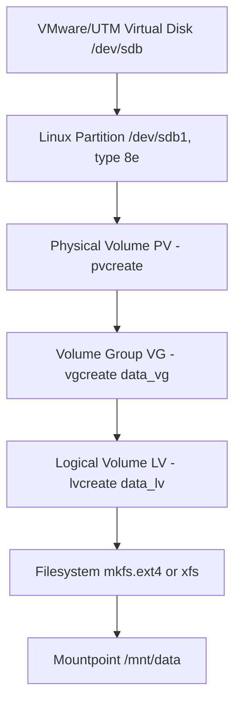

# Storage LVM (Logical Volume Manager) in Linux

This guide explains **basic LVM storage management commands in Linux** with definitions, options, and practical examples. It also includes a **practice scenario** for working with **VMware/UTM virtual disks** and managing **LVM storage** efficiently.

---

## 🔎 Visual Overview

### ASCII Diagram
+--------------------------------------------------------------+
| VMware/UTM / Hypervisor Layer |
| (Add Virtual Disk: e.g., 20G VMDK attached as /dev/sdb) |
+-----------------------------+--------------------------------+
|
v
+-----------------------------+--------------------------------+
| Linux Block Device & Partitioning |
| /dev/sdb ── fdisk/parted ──> /dev/sdb1 (type: 8e / LVM) |
+-----------------------------+--------------------------------+
|
v
+-----------------------------+--------------------------------+
| LVM Physical Volume (PV) |
| pvcreate /dev/sdb1 |
+-----------------------------+--------------------------------+
|
v
+-----------------------------+--------------------------------+
| LVM Volume Group (VG) |
| vgcreate data_vg /dev/sdb1 |
| (Pool of storage; can include multiple PVs: sdb1, sdc1...) |
+-----------------------------+--------------------------------+
|
v
+-----------------------------+--------------------------------+
| LVM Logical Volume (LV) |
| lvcreate -n data_lv -L 10G data_vg |
| (Resizable logical disk carved out from the VG) |
+-----------------------------+--------------------------------+
|
v
+-----------------------------+--------------------------------+
| Filesystem & Mountpoint |
| mkfs.ext4 /dev/data_vg/data_lv |
| mkdir -p /mnt/data |
| mount /dev/data_vg/data_lv /mnt/data |
+--------------------------------------------------------------+


---

### Mermaid Diagram

---
<!-- 
https://mermaid.ink/img/pako:eNpNks1u6jAQRl9lNOtAfiFpFle6JYUNSCzaLJqgypcMwSKOI8dJ4SLevU6gVWflsc_5bEtzxb0sCGM8VPJzf2RKw2uS12Dqb5ZuPpki--11AylXumMVJLw9gV1Qb7fFvx1MJn_gOVvzujvD1shcc1n_nLsW6EtDENHuHvk8Cotse7y0fG_iUll1gmCbwgSafq-I6W92MbJJ9kBWSnYNpCsD9uUdhIJp9tGXDyEZhZdsLcvf2eshu-p_K1X_UF5GZZkteUXtpdUkQJwO7ZTOOgCp4HxoH-RyJFfZRna1biSvNdii1vaQt0MLS8ULjLXqyEJBSrChxesg56iPJCjH2CwLpk455vXNOA2r36UU35r5YHnE-MCq1nRdY6Ip4axUTPzsKqoLUovhERi7fjSGYHzFM8Ze5E7ngR94zlP45M69wMILxn44DfwwiPyZ5zp-EEU3C_-PtzrTKJw5pry5E4aON_MtpIJrqTb3kRgn4_YFM-6p6w?type=png
---
https://mermaid.live/edit#pako:eNpNks1u6jAQRl9lNOtAfiFpFle6JYUNSCzaLJqgypcMwSKOI8dJ4SLevU6gVWflsc_5bEtzxb0sCGM8VPJzf2RKw2uS12Dqb5ZuPpki--11AylXumMVJLw9gV1Qb7fFvx1MJn_gOVvzujvD1shcc1n_nLsW6EtDENHuHvk8Cotse7y0fG_iUll1gmCbwgSafq-I6W92MbJJ9kBWSnYNpCsD9uUdhIJp9tGXDyEZhZdsLcvf2eshu-p_K1X_UF5GZZkteUXtpdUkQJwO7ZTOOgCp4HxoH-RyJFfZRna1biSvNdii1vaQt0MLS8ULjLXqyEJBSrChxesg56iPJCjH2CwLpk455vXNOA2r36UU35r5YHnE-MCq1nRdY6Ip4axUTPzsKqoLUovhERi7fjSGYHzFM8Ze5E7ngR94zlP45M69wMILxn44DfwwiPyZ5zp-EEU3C_-PtzrTKJw5pry5E4aON_MtpIJrqTb3kRgn4_YFM-6p6w
-->

---

## 🔑 Why Use LVM?

LVM (Logical Volume Manager) provides:
- Flexible disk management.
- Resize volumes with minimal or no downtime.
- Combine multiple physical disks into one logical pool.
- Snapshots and better scalability.

## 📂 Basic Storage & Partition Commands

### 1. `fdisk` – Partition Management
```bash
fdisk /dev/sdX
```

Options:
* `m` → Show menu.
* `n` → Create a new partition.
* `d` → Delete a partition.
* `p` → Print partition table.
* `w` → Write changes and exit.

Example:
```bash
fdisk /dev/sdb
```
Creates partitions on the disk `/dev/sdb`.

📝 Note: `cfdisk` is a user-friendly alternative.

---

### 2. `lsblk` – List Block Devices
```bash
lsblk
```
Shows block devices, their sizes, and mount points.

```bash
lsblk -f
```
Lists devices with filesystem information.

### 3. `blkid` – Display UUID of Devices
```bash
blkid /dev/sdb1
```
Shows UUIDs of partitions/disks (useful for `/etc/fstab`).

### 4. `df -Th` – Show Disk Usage
```bash
df -Th
```
Options:
* `-T` → Show filesystem type.
* `-h` → Human-readable (GB/MB).   

Displays mounted filesystems and usage.

---

## 🔧 LVM Commands

### 1. `pvcreate` – Initialize Physical Volume
```bash
pvcreate /dev/sdb1
```
Prepares a partition for LVM.

---

### 2. `vgcreate` – Create Volume Group
```bash
vgcreate my_vg /dev/sdb1
```
Creates volume group `my_vg` using `/dev/sdb1`.

---

### 3. `lvcreate` – Create Logical Volume
```bash
lvcreate -n my_lv -L 10G my_vg
```
Options:
* `-n` → Logical volume name.
* `-L` → Size in GB/MB.

Creates a 10GB logical volume named `my_lv` in volume group `my_vg`.

---

### 4. `pvextend` – Extend Physical Volume
```bash
pvcreate /dev/sdc1
vgextend my_vg /dev/sdc1
```
Adds new partition `/dev/sdc1` to LVM.
Expands `my_vg` to include new physical volume.

---

### 5. `lvextend` – Extend Logical Volume
```bash
lvextend -L +5G /dev/my_vg/my_lv
```
Expands `my_lv` by 5GB.   

---

### 6. `Remove` Volumes
```bash
lvremove /dev/my_vg/my_lv   # Deletes logical volume my_lv.
vgremove my_vg              # Deletes my_vg volume group.
pvremove /dev/sdb1          # Removes LVM label from partition.
```
---

### 7. `Merge` Volume Groups
```bash
vgs
vgrename old_vg new_vg
vgmerge target_vg source_vg
```
Merges two volume groups into `target_vg`.   

---
### 8. `resize2fs`/`xfs_growfs` Format the Logical Volume
```bash
resize2fs /dev/my_vg/my_lv   # Format filesytem for ext4
xfs_growfs /mnt/data         # Format filesystem for XFS, takes /mount/point as argument
```
---

### 9. `Mount` Logical Volume
```bash
mount /dev/my_vg/my_lv /mnt/data
```
To make it permanent:
```bash
echo "/dev/my_vg/my_lv /mnt/data ext4 defaults 0 0" >> /etc/fstab
mount -a # Mount all directories from /etc/fstab
```
---

## 🏢 Practice Scenario: VMware/UTM + LVM Setup

### Step 1: Add New Disk in VMware/UTM
* Open VMware/UTM → VM Settings → Add New Hard Disk (20GB).
* Boot VM and confirm:
```bash
lsblk
```

### Step 2: Partition the Disk
```bash
fdisk /dev/sdb
```

### Step 3: Create Physical Volume
```bash
pvcreate /dev/sdb1
```

### Step 4: Create Volume Group
```bash
vgcreate data_vg /dev/sdb1
```

### Step 5: Create Logical Volume
```bash
lvcreate -n data_lv -L 5G data_vg
```

### Step 6: Format & Mount
```bash
mkfs.ext4 /dev/data_vg/data_lv
mkdir /mnt/data
mount /dev/data_vg/data_lv /mnt/data
```

### Step 7: Extend with New Disk
```bash
pvcreate /dev/sdc1
vgextend data_vg /dev/sdc1
lvextend -L +10G /dev/data_vg/data_lv
resize2fs /dev/data_vg/data_lv
```

### Step 8: Remove (if needed)
```bash
umount /mnt/data
lvremove /dev/data_vg/data_lv
vgremove data_vg
pvremove /dev/sdb1 /dev/sdc1
```

---

## ✅ Best Practices
* Always **backup data** before resizing or removing volumes.
* Use **XFS** for large filesystems; use `xfs_growfs` to expand (no shrink).
* Prefer **UUID** in `/etc/fstab` to avoid device-name changes after reboot.
* Use `lsblk -f` and `blkid` frequently to confirm targets before running LVM commands.
* Consider **LVM snapshots** for backups and short-lived test changes.
* For GPT disks and >2TB disks, consider `parted` instead of `fdisk`.

---

## 📊 Summary (Quick Reference)
* Partition tools: `fdisk`, `lsblk`, `blkid`, `df -Th`.
* LVM workflow:
  * `pvcreate` → `vgcreate` → `lvcreate` → `mkfs` → `mount`.
* Extensions: `pvextend`, `vgextend`, `lvextend`, `resize2fs`/`xfs_growfs`.
* Cleanup: `lvremove`, `vgremove`, `pvremove`.
* Advanced: `vgmerge` for merging groups.

This process ensures efficient **LVM storage management in Linux** with best practices for **disk partitioning**, **volume groups**, **logical volumes**, and **filesystem expansion**.

---